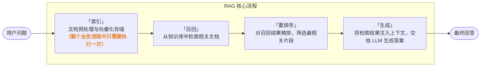
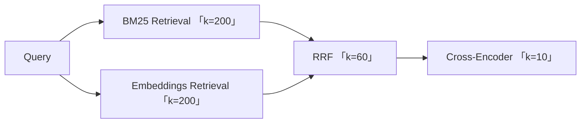

## 前言

这份文档主要内容是说明一个从零构建现代 AI 系统的方法论指南，文档主要以 LLM, RAG, Agentic Workflow 贯穿从单一的大模型 API 调用，到具备“手脚”（Function Calling）、“眼耳”（多模态）、“大脑库”（RAG）以及“独立思考逻辑”（Agentic Workflow）的技术路线演进，以及各个组成部分的基本概念，和如何结合主流的如 LiteLLM、LangChain 和 DSPy 等生态工具快速入手。

仓库使用 Markdown 作为主文档，主要包含基本概念和演进路线，安装示例与代码示例则在 Notebook 中，在 Notebook 中可以更加清晰的查看安装步骤或代码块执行时输出的结果，你也可以手动更改代码并运行代码块来实时查看模型输出。

Notebook 中的示例需要调用大模型，示例中的模型提供商是均是 Google AI Studio，且使用 OpenAI 兼容的方式调用，你可以根据自己的硬件条件选择以下方式运行，一个是在本机部署 Ollama 或使用 Google AI Studio 的免费额度 

- 本地私有化部署 (Ollama)
  如果你拥有性能较好的 GPU，跳转到 [什么是 Ollama](#什么是-ollama) 查看如何安装 Ollama，安装 Ollama 成功后，将代码中的 API Base 地址指向 `http://localhost:11434/v1` 即可，或者使用 CPU 进行模型推理。
- Google AI Studio
  Google AI Studio 提供了免费的 API 调用额度调用 Gemini 系列模型。
- 或在本地使用 Transformers 或 vLLM 等推理平台，只需要更改示例中 API Base 和 API Key 即可。


## 概述

- [什么是 LLM](#什么是-llm)
  - [LLM 调用范式的演进](#llm-调用范式的演进)
  - [什么是 Ollama](#什么是-ollama)
- [什么是 RAG](#什么是-rag)
  - [什么是 Retrieval](#什么是-retrieval)
  - [什么是 Rerank](#什么是-rerank)
  - [如何结合 RAG 和 DSPy](#如何结合-rag-和-dspy)
- [什么是 Agent](#什么是-agent)
  - [什么是 PydanticAI](#什么是-pydanticai)
- [扩展资源](#扩展资源)


## 什么是 LLM

LLM 是 Large Language Model 的缩写，翻译过来是大语言模型，简单来说，它是一种基于深度学习的人工智能系统，专门用于理解、生成和处理人类语言。从底层的技术逻辑来看，LLM 本质上是一个基于统计学的超大规模高维概率预测引擎。

### LLM 调用范式的演进

理解 LLM 的调用方式，有助于看清这门技术从实验室走向生产的完整路径。对于初学者而言，不必深入每一阶段的细节，但了解其演进脉络能帮助你判断：在什么场景下该用什么工具。

**阶段一：底层框架时代**

在 OpenAI API 出现之前，调用大模型的唯一方式是在 PyTorch 或 TensorFlow 中直接加载权重、手写前向传播。那时的模型就是"代码 + 权重"，开发者必须自己处理张量、注意力矩阵和显存分配。门槛极高，只有具备深度学习背景的工程师才能上手。

**阶段二：Pipeline 与工具库时代**

随着 Transformer 架构的普及，Hugging Face 推出了 Transformers 库，将模型封装为可复用的 Pipeline。开发者不再需要手动搭建网络结构，而是通过 `pipeline("text-generation")` 这样的高层接口就能调用预训练模型。同一时期，HanLP 等工具库也在中文 NLP 领域做了类似的封装工作——将分词、标注、解析等任务串联为流水线。这个阶段的核心理念是“把底层算子藏起来，让工程师专注业务逻辑”。

[Transformers Notebook 代码示例](notebooks/Transformers.ipynb)

**阶段三：API 时代**

今天，绝大多数应用开发者接触 LLM 的第一行代码是 HTTP 请求。OpenAI 风格的 API 将模型进一步抽象为"输入文本 → 输出文本"的黑盒，开发者甚至不需要知道模型架构、不需要安装 PyTorch、不需要管理 GPU。这种极简的调用方式极大降低了 AI 应用的开发门槛，也是 LLM 能够迅速普及到各行各业的根本原因。

从"手写张量运算"到"一行 HTTP 调用"，LLM 的调用范式经历了三次跃迁。每一次跃迁都在做同一件事：把复杂度下沉，把易用性上浮。

### 什么是 Ollama

Ollama 是一个开源项目，目的是简化在本地机器上运行大型语言模型（LLMs）的过程。它提供用户友好的界面和功能，使先进的人工智能技术变得易于获取且可定制。

安装 Ollama:
```sh
curl -fsSL https://ollama.com/install.sh | sh
```

> 如果你发现 Ollama 没有默认调用你的 GPU，或者你通过容器运行 Ollama，你可以通过设置此变量来显式设置 GPU 的分配策略。
> 
> 操作步骤：
> - 设置环境变量：`export OLLAMA_NUM_GPU=-1`
> - 启动 Ollama：`ollama serve`

Ollama 安装好后可以通过 `ollama list` 查看可用模型。

查看如何安装 Ollama，使用 Ollama SDK 以及兼容 OpenAI 的方式调用 Ollama 服务，请点击 [Ollama Notebook](notebooks/Ollama.ipynb) 查看 Notebook 代码块运行结果以及查看模型输出。

**为 Ollama 配置 AMD 显卡加速**

在 Linux 环境下为 Ollama 配置 AMD 显卡支持时，请注意以下几点：

> 以 Ubuntu 24.04 为例。

1. ROCm 驱动版本
   确保系统中已安装兼容的 ROCm 运行库。Ollama 通常需要 ROCm 驱动和软件栈，AMD 显卡通过 ROCm 平台提供 GPU 加速支持。
```sh
wget https://repo.radeon.com/amdgpu-install/6.4.3/ubuntu/noble/amdgpu-install_6.4.60403-1_all.deb
sudo apt install ./amdgpu-install_6.4.60403-1_all.deb
sudo apt update
sudo apt install python3-setuptools python3-wheel
sudo usermod -a -G render,video $LOGNAME # 必须将当前用户添加到 render 和 video 用户组，否则 Ollama 进程可能无法调用 GPU 硬件
sudo apt install rocm
```

2. 安装 AMD GPU 驱动
```sh
wget https://repo.radeon.com/amdgpu-install/6.4.3/ubuntu/noble/amdgpu-install_6.4.60403-1_all.deb
sudo apt install ./amdgpu-install_6.4.60403-1_all.deb
sudo apt update
sudo apt install "linux-headers-$(uname -r)" "linux-modules-extra-$(uname -r)"
sudo apt install amdgpu-dkms
```

3. 驱动环境变量
   如果你的 GPU 属于较旧系列（如 RDNA 1 代），可能需要设置环境变量来强制兼容：
   `export HSA_OVERRIDE_GFX_VERSION=10.3.0`

4. 显存分配
   AMD 显卡在 Linux 下的显存管理较为严格，建议关闭系统桌面环境的硬件加速或增加 Swap 空间，以防止加载大参数模型时发生显存溢出（OOM）。

5. 验证是否启用 GPU：
   安装支持 ROCm 的 PyTorch：
```sh
pip install torch torchvision torchaudio --index-url https://download.pytorch.org/whl/rocm6.4
```
   测试 GPU 是否启用，执行代码应输出 True（ROCm 模拟 CUDA 接口）：
```python
import torch

print(torch.cuda.is_available())
```

6. 配置 Ollama 使用 AMD GPU 加速：
   `export OLLAMA_AMDGPU=1`


## 什么是 RAG

RAG（Retrieval-Augmented Generation，检索增强生成）是一种将外部知识检索与大语言模型生成能力相结合的技术架构。它通过从知识库中实时检索相关信息，将其作为上下文注入到提示词中，从而让大模型基于准确、最新的知识回答问题，而不是仅依赖"公共知识"（训练的参数化知识）。

RAG 的核心价值在于解决大模型的三个固有缺陷：知识有截止日期、容易产生幻觉、以及无法访问私有数据。通过引入检索环节，RAG 让 LLM 从指定文档中查找答案，而不再限制于训练的知识。

从架构上看，一个完整的 RAG 系统通常由四个核心环节串联而成：



各环节职责如下：

- 索引（Indexing）：负责将原始文档切片、编码为向量，并构建可高效检索的索引。这是 RAG 的"基础设施"，决定了系统能覆盖多少知识。
- 召回（Retrieval）：根据用户查询，从索引中快速筛选出相关候选文档。这是速度与召回率的平衡战场，常用 Embeddings 语义检索、BM25 关键词检索或混合检索。
- 重排序（Rerank）：对召回的候选结果进行二次打分与精排，将真正最相关的片段排在前面。它弥补了召回阶段"求快不求准"的不足。
- 生成（Generation）：将经过重排序的检索结果与用户问题一起组装为提示词，交给大语言模型生成最终回答。这是 RAG 的"临门一脚"。

下文将围绕召回、重排序两个环节展开，介绍其中的关键技术选型与实现方法。

### 什么是 Retrieval

在 RAG 架构中，召回（Retrieval）是整个流程的第一步，也是决定最终生成质量的关键瓶颈。它的任务是从海量文档中快速找到与用户问题相关的候选内容。如果召回阶段漏掉了关键信息，后续无论多强大的大模型都无法补全缺失的上下文。

召回的核心挑战在于语义鸿沟：用户提出的问题与文档中的表述往往并不一致。例如用户问"如何提高系统运行效率"，而文档中写的是"系统性能优化方案"——两者意思相同，但字面重叠极少。如何跨越这道鸿沟，是选择召回技术的根本出发点。

目前业界最主流的两种召回方案分别是 Embeddings 和 BM25。它们从原理到适用场景截然不同，理解它们的差异是设计高效 RAG 系统的前提。

**两种检索范式**

- 什么是 Embeddings:
  > Embeddings（嵌入，也称为"语义相似度检索"）通过深度学习模型将文本转换成数学向量，把"语义理解"转化为"向量距离计算"。核心假设是：意思相近的文本，在向量空间中的距离也更近。它不关心字面是否相同，而是捕捉深层语义关联。
  - 原理：将查询和文档分别编码为向量，通过余弦相似度或点积计算匹配程度
  - 优势：能理解同义词、改写、省略；对非结构化文档友好
  - 局限：结果具有概率性，无法保证 100% 召回关键文档；对精确实体匹配如 ID、编号类的文本无能为力
- 什么是 BM25:
  > BM25（概率关键词检索）是一种基于统计的概率检索算法，通过词频（TF）和逆文档频率（IDF）等特征，计算查询词与文档中词的相关性分数。它严格依赖字面匹配，结果确定且可解释。
  - 原理：基于词项在查询和文档中的出现频率进行加权打分
  - 优势：精确、确定、可解释；对明确关键词的检索延迟极低
  - 局限：无法理解语义改写；没有关键词重叠时直接漏检

**如何选择 Embeddings 与 BM25**

Embeddings 在以下 RAG 场景中几乎是不可替代：
- 语义搜索。当用户问题与文档表述存在"换个说法"的差异时，Embeddings 能够桥接语义鸿沟。例如用户搜索"提高电网运行效率的方法"，文档中写的是"电力系统优化方案"——没有关键词重叠，BM25 会直接 MISS，而 Embeddings 能准确命中。
- 非结构化文档问答。面对技术手册、制度规范、合同邮件等表达极其不规范的非结构化文本，Embeddings 可以理解同义词、改写和省略，BM25 则几乎无能为力。典型问题如"主变过载时应如何处理"，需要的是语义相关段落，而非字面匹配。
- 相似推荐。基于向量相似度的推荐是 Embeddings 的本质优势场景，无论是推荐相似文章、相似商品还是相似工单，Embeddings 都能给出符合语义直觉的结果。
- 多模态检索。图搜文、文搜图、音频相似等场景完全依赖向量表示，BM25 完全不适用。

BM25 在需要 100% 确定性的场景中不可替代：
- 精确实体匹配。当检索涉及公司名称、客户 ID、产品编号、财务指标等必须精确对应的实体时，BM25 的确定性是 Embeddings 无法比拟的。例如"中天钢铁"必须精确匹配到"中天钢铁集团有限公司"，Embeddings 的语义泛化反而会把"中天科技""中天建设"等无关实体排在前列。
- 主数据匹配。Embeddings 无法理解唯一性、主键、法律主体等概念，在主数据系统中只能做辅助。
- 金融与财务指标检索。"金额"与"数量"在语义上相近，但在财务系统中是完全不同的指标；"同比"与"环比"也不能混用。Embeddings 容易"理解错"，而 BM25 通过精确词项匹配确保正确性。
- 强规则系统。风控、审计、计费、合规等场景容错率极低，Embeddings 只能做辅助，核心匹配必须依赖 BM25 或规则引擎。

### 什么是 Rerank

Rerank（重排序）是 RAG 流程中位于「召回」与「生成」之间的关键精排环节。召回阶段（如向量检索、BM25、混合检索）的目标是从海量文档中快速筛选出与查询相关的候选集，通常以高召回率为优先，但排序质量不一定最优。Rerank 的作用是对召回后的候选文档进行二次打分与重新排序，将真正最相关、信息密度最高的文档排在前面，从而显著提升大模型生成答案的准确性和可信度。

从实现方式上看，Rerank 可以分为两大类：一类是无模型的排序融合算法（如 RRF、Weighted RRF 等），通过数学方法将多个检索器的结果合并为统一排序，延迟极低、无需训练；另一类是基于模型的精排方法（如 BGE Rerank、Cohere Rerank 等），利用 Cross-Encoder 对查询和文档进行逐对语义理解打分，排序质量更高但计算成本相对较大。在实际项目中，通常先用 RRF 或加权融合对多路召回结果做粗排融合，再用 Cross-Encoder 做 Top-K 精排，形成完整的检索到重排序链路。

[Reranks Notebook 代码示例](notebooks/Reranks.ipynb)


#### Rerank 融合算法

在 Rerank 融合算法实践项目中，通常为了保持数据的唯一性与内存效率，建议把文本转换成哈希。下面是转换成 MD5 哈希的代码实现，后续有部分示例代码会引用 `get_md5_hash` 函数:

```python
import hashlib

def get_md5_hash(text: str) -> str:
    normalized_text = " ".join(text.split())
    return hashlib.md5(
        normalized_text.encode("utf-8"), usedforsecurity=False
    ).hexdigest()
```

**RRF**

RRF（Reciprocal Rank Fusion）是一种 无模型、无训练的排序融合算法，核心思想是融合后按综合得分排序，交叉出现的更高一致性者胜出。

算法公式

$$ Score(d) = \sum_{r \in R} \frac{1}{k + rank(d, r)} $$

> 这里的 `k` 是平滑参数（默认 60，可调），用来控制前 `n` 名项的贡献分布。

RRF 优点:
- 无模型，纯工程级算法实现
- 代码实现简单
- 可以对不同检索器召回结果进行融合
- 延迟极低

典型流程示例:



RRF 代码示例:

```python
def rrf(document_lists: list[list[str]], k: int = 60) -> list[tuple[str, float]]:
    doc_map = {}
    for doc_list in document_lists:
        for rank, text in enumerate(doc_list, start=1):
            doc_hash = get_md5_hash(text)
            if doc_hash not in doc_map:
                doc_map[doc_hash] = {"text": text, "score": 0.0}
            doc_map[doc_hash]["score"] += 1.0 / (k + rank)
    return [
        (data["text"], data["score"])
        for _, data in sorted(
            doc_map.items(), key=lambda item: item[1]["score"], reverse=True
        )
    ]
```

<details>
<summary>RRF 用例与测试，点击展开</summary>

```python
document_lists = [
    # 模拟 BM25 召回结果
    [
        "使用 Python 的多线程与多进程模块提高计算效率",
        "深度解析 Python 内存管理与垃圾回收机制",
        "如何利用异步 IO (asyncio) 优化网络爬虫性能",
        "Python C 扩展编写指南：从原生层面加速代码",
    ],
    # 模拟 Embeddings 召回结果
    [
        "如何利用异步 IO (asyncio) 优化网络爬虫性能",
        "大规模分布式 AI 训练中的通信瓶颈优化",
        "使用 Python 的多线程与多进程模块提高计算效率",
        "针对 LLM 推理服务的并发处理方案探讨",
    ],
]

result = rrf(document_lists)
#  	Document 	Score
# 0 	使用 Python 的多线程与多进程模块提高计算效率 	0.032266
# 1 	如何利用异步 IO (asyncio) 优化网络爬虫性能 	0.032266
# 2 	深度解析 Python 内存管理与垃圾回收机制 	0.016129
# 3 	大规模分布式 AI 训练中的通信瓶颈优化 	0.016129
# 4 	Python C 扩展编写指南：从原生层面加速代码 	0.015625
# 5 	针对 LLM 推理服务的并发处理方案探讨 	0.015625
```
</details>


**Weighted RRF**

加权 RRF 是在标准 RRF 的基础上引入了权重因子 $w$。它依然只看排名，区别在于如果你认为全文搜索的结果比向量搜索更准确，可以给全文搜索更高的权重。

算法公式

$$ Score(d) = \sum_{i=1}^{n} w_i \cdot \frac{1}{k + rank(d, r_i)} $$

- $rank(d, r_i)$：文档 $d$ 在第 $i$ 个结果列表中的排名。
- $k$：平滑常数（通常默认为 60），防止排名靠前的文档权重过大。
- $w_i$：分配给第 $i$ 个检索渠道的权重（例如：向量检索权重 0.7，关键词检索权重 0.3）。

下面是 Weighted RRF 的简单实现：

```python
def weighted_rrf(document_lists: list[list[str]], weights: list[float] = None, k: int = 60) -> list[tuple[str, float]]:
    if weights is None:
        weights = [1.0] * len(document_lists)
    doc_map = {}
    for doc_list, weight in zip(document_lists, weights):
        for rank, text in enumerate(doc_list, start=1):
            doc_hash = get_md5_hash(text)
            if doc_hash not in doc_map:
                doc_map[doc_hash] = {"text": text, "score": 0.0}
            doc_map[doc_hash]["score"] += weight / (k + rank)
    return [
        (data["text"], data["score"])
        for _, data in sorted(
            doc_map.items(), key=lambda item: item[1]["score"], reverse=True
        )
    ]
```

<details>
<summary>Weighted RRF 用例与测试，点击展开</summary>

```python
document_lists = [
    # 模拟 BM25 召回结果
    [
        "使用 Python 的多线程与多进程模块提高计算效率",
        "深度解析 Python 内存管理与垃圾回收机制",
        "如何利用异步 IO (asyncio) 优化网络爬虫性能",
        "Python C 扩展编写指南：从原生层面加速代码",
    ],
    # 模拟 Embeddings 召回结果
    [
        "如何利用异步 IO (asyncio) 优化网络爬虫性能",
        "大规模分布式 AI 训练中的通信瓶颈优化",
        "使用 Python 的多线程与多进程模块提高计算效率",
        "针对 LLM 推理服务的并发处理方案探讨",
    ],
]

result = weighted_rrf(document_lists, weights=[0.7, 0.3])
#  	Document 	Score
# 0 	使用 Python 的多线程与多进程模块提高计算效率 	0.016237
# 1 	如何利用异步 IO (asyncio) 优化网络爬虫性能 	0.016029
# 2 	深度解析 Python 内存管理与垃圾回收机制 	0.011290
# 3 	Python C 扩展编写指南：从原生层面加速代码 	0.010937
# 4 	大规模分布式 AI 训练中的通信瓶颈优化 	0.004839
# 5 	针对 LLM 推理服务的并发处理方案探讨 	0.004687
```
</details>


**线性加权融合 (Linear Weighted Fusion)**

线性加权融合是一种基于分数的融合算法。它不关心排名，而是直接对各路算法输出的原始分数进行加权求和。

算法公式

$$ Score(d) = \sum_{i=1}^{n} w_i \cdot score_i(d) $$

- $d$：文档 / 候选结果
- $score_i(d)$：第 $i$ 个模型或通道给 $d$ 的分数
- $w_i$：该通道的权重
- $n$：通道数量

线性加权融合的运用场景:
- 如果使用多个不同的 Embeddings 模型，线性加权运用简单且非常有效。
- 如果 RAG 流程中同时使用了 Embeddings 与 BM25，则需要实现归一化，向量分值通常在 $0 \sim 1$ 之间，而 BM25 分数可能在 $0 \sim 100$，高分值的通道会完全淹没低分值的通道。如果分数的分布非常稳定且归一化得当，它能比 RRF 更精准地反映文档的相关度。

下面是 WeightedRanker 的简单实现：

```python
def weighted_rank(
    docs_scores: dict[str, dict[str, float]],
    weights: dict[str, float],
    alpha_tie_break: bool = False,
):
    final_scores = {}

    for doc, scores in docs_scores.items():
        # Calculate the weighted sum of scores for the current document
        # Using a generator expression with sum() for conciseness and readability
        # weights.get(k, 0) handles cases where a score type might not have a corresponding weight, defaulting to 0.
        total = sum(weights.get(k, 0) * v for k, v in scores.items())
        final_scores[doc] = total

    # Define the sorting key based on the alpha_tie_break parameter
    if alpha_tie_break:
        # Sort primarily by score (descending), then by document name (ascending) for tie-breaking
        # Multiplying score by -1 ensures descending order for scores when sorting ascending by the tuple.
        def sort_key(x):
            return (-x[1], x[0])

        # Since the key is (-score, doc_name), sorted will naturally sort scores descending and doc_names ascending for ties.
        return sorted(final_scores.items(), key=sort_key)
    else:
        # Sort only by score (descending), relying on Python's stable sort for ties if alpha_tie_break is False.
        return sorted(final_scores.items(), key=lambda x: x[1], reverse=True)
```

<details>
<summary>WeightedRanker 用例与测试，点击展开</summary>

```python
print("\n--- Running tests for updated weighted_rank function ---")

print("\nCase 1: Basic functionality with multiple documents and scores")
docs_scores_1 = {
    "doc_A": {"score1": 0.8, "score2": 0.6},
    "doc_B": {"score1": 0.9, "score2": 0.5},
    "doc_C": {"score1": 0.7, "score2": 0.7},
}
weights_1 = {"score1": 0.6, "score2": 0.4}
expected_output_1 = [("doc_B", 0.74), ("doc_A", 0.72), ("doc_C", 0.7)]
actual_output_1 = weighted_rank(docs_scores_1, weights_1)
assert actual_output_1 == expected_output_1, (
    f"Test Case 1 Failed: Expected {expected_output_1}, Got {actual_output_1}"
)
print(actual_output_1)

print("\nCase 2: Cases where some weights are zero")
docs_scores_2 = {
    "doc_A": {"score1": 0.8, "score2": 0.6},
    "doc_B": {"score1": 0.9, "score2": 0.5},
}
weights_2 = {"score1": 1.0, "score2": 0.0}
expected_output_2 = [("doc_B", 0.9), ("doc_A", 0.8)]
actual_output_2 = weighted_rank(docs_scores_2, weights_2)
assert actual_output_2 == expected_output_2, (
    f"Test Case 2 Failed: Expected {expected_output_2}, Got {actual_output_2}"
)
print(actual_output_2)

print(
    "\nCase 3: Cases with missing keys in the weights dictionary (default weight should be 0)"
)
docs_scores_3 = {
    "doc_A": {"score1": 0.8, "score2": 0.6},
    "doc_B": {"score1": 0.9, "score2": 0.5},
}
weights_3 = {"score1": 1.0}
expected_output_3 = [("doc_B", 0.9), ("doc_A", 0.8)]  # score2 should have 0 weight
actual_output_3 = weighted_rank(docs_scores_3, weights_3)
assert actual_output_3 == expected_output_3, (
    f"Test Case 3 Failed: Expected {expected_output_3}, Got {actual_output_3}"
)
print(actual_output_3)

print("\nCase 4: Edge case - empty docs_scores dictionary")
docs_scores_4 = {}
weights_4 = {"score1": 0.5, "score2": 0.5}
expected_output_4 = []
actual_output_4 = weighted_rank(docs_scores_4, weights_4)
assert actual_output_4 == expected_output_4, (
    f"Test Case 4 Failed: Expected {expected_output_4}, Got {actual_output_4}"
)
print(actual_output_4)

print(
    "\nCase 5: Edge case - empty weights dictionary (all scores should have 0 weight)"
)
docs_scores_5 = {
    "doc_A": {"score1": 0.8, "score2": 0.6},
    "doc_B": {"score1": 0.9, "score2": 0.5},
}
weights_5 = {}
actual_output_5 = weighted_rank(docs_scores_5, weights_5)
for doc, score in actual_output_5:
    assert score == 0.0, (
        f"Test Case 5 Failed: Score for {doc} should be 0.0, Got {score}"
    )
assert set([doc for doc, _ in actual_output_5]) == set(docs_scores_5.keys()), (
    "Test Case 5 Failed: Documents mismatch"
)
print(actual_output_5)

print("\nCase 6: Scenarios where all scores for a document sum to zero or are equal")
docs_scores_6 = {
    "doc_X": {"s1": 0.5, "s2": -0.5},
    "doc_Y": {"s1": 0.0, "s2": 0.0},
    "doc_Z": {"s1": 1.0, "s2": 0.0},
}
weights_6 = {"s1": 1.0, "s2": 1.0}
expected_output_6 = [("doc_Z", 1.0), ("doc_X", 0.0), ("doc_Y", 0.0)]
actual_output_6 = weighted_rank(docs_scores_6, weights_6)
assert round(actual_output_6[0][1], 5) == expected_output_6[0][1], (
    f"Test Case 6 Failed doc_Z score: Expected {expected_output_6[0][1]}, Got {actual_output_6[0][1]}"
)
assert round(actual_output_6[1][1], 5) == expected_output_6[1][1], (
    f"Test Case 6 Failed doc_X score: Expected {expected_output_6[1][1]}, Got {actual_output_6[1][1]}"
)
assert round(actual_output_6[2][1], 5) == expected_output_6[2][1], (
    f"Test Case 6 Failed doc_Y score: Expected {expected_output_6[2][1]}, Got {actual_output_6[2][1]}"
)
assert set([doc for doc, _ in actual_output_6]) == set(docs_scores_6.keys())
print(actual_output_6)

print("\nCase 7: Negative weights")
docs_scores_7 = {"doc_A": {"s1": 1.0, "s2": 0.5}, "doc_B": {"s1": 0.5, "s2": 1.0}}
weights_7 = {"s1": 1.0, "s2": -1.0}
expected_output_7 = [("doc_A", 0.5), ("doc_B", -0.5)]
actual_output_7 = weighted_rank(docs_scores_7, weights_7)
assert actual_output_7 == expected_output_7, (
    f"Test Case 7 Failed: Expected {expected_output_7}, Got {actual_output_7}"
)
print(actual_output_7)

print("\nCase 8: All scores equal, check descending order and stable sort")
docs_scores_8 = {"doc_1": {"s": 1.0}, "doc_2": {"s": 1.0}, "doc_3": {"s": 1.0}}
weights_8 = {"s": 1.0}
expected_output_8 = [
    ("doc_1", 1.0),
    ("doc_2", 1.0),
    ("doc_3", 1.0),
]  # relies on stable sort
actual_output_8 = weighted_rank(docs_scores_8, weights_8)
assert actual_output_8 == expected_output_8, (
    f"Test Case 8 Failed: Expected {expected_output_8}, Got {actual_output_8}"
)
print(actual_output_8)

print("\nCase 9: All scores equal with alpha_tie_break = True")
docs_scores_9 = {"doc_Z": {"s": 1.0}, "doc_A": {"s": 1.0}, "doc_M": {"s": 1.0}}
weights_9 = {"s": 1.0}
expected_output_9 = [
    ("doc_A", 1.0),
    ("doc_M", 1.0),
    ("doc_Z", 1.0),
]  # Alphabetical tie-breaking
actual_output_9 = weighted_rank(docs_scores_9, weights_9, alpha_tie_break=True)
assert actual_output_9 == expected_output_9, (
    f"Test Case 9 Failed (alpha_tie_break): Expected {expected_output_9}, Got {actual_output_9}"
)
print(actual_output_9)

print("\nCase 10: Mixed scores with alpha_tie_break = True, demonstrating tie-breaking")
docs_scores_10 = {
    "doc_B": {"score": 0.7},
    "doc_A": {"score": 0.7},
    "doc_C": {"score": 0.9},
}
weights_10 = {"score": 1.0}
# Expected: doc_C first, then doc_A, then doc_B due to alphabetical tie-breaking
expected_output_10 = [("doc_C", 0.9), ("doc_A", 0.7), ("doc_B", 0.7)]
actual_output_10 = weighted_rank(docs_scores_10, weights_10, alpha_tie_break=True)
assert actual_output_10 == expected_output_10, (
    f"Test Case 10 Failed (alpha_tie_break mixed scores): Expected {expected_output_10}, Got {actual_output_10}"
)
print(actual_output_10)

print("\nAll updated test cases passed!")
```
</details>

**归一算法**

<details>
<summary>以下是常见的归一化算法介绍与代码实现，点击展开</summary>

- **Min-Max Scaling**

This technique rescales a feature to a fixed range, usually 0 to 1. It is useful when you need to normalize data to a specific boundary.

$$ \hat{s}_i = \frac{s_i - \min(s)}{\max(s) - \min(s)} $$

适用场景：
a. 分数区间稳定
b. 没有太多离群点

```python
def min_max_scale(scores: dict[str, float]) -> dict[str, float]:
    """Applies Min-Max scaling to a dictionary of scores.

    Args:
        scores (dict[str, float]): A dictionary where keys are score names (or doc IDs)
                                   and values are the scores to be scaled.

    Returns:
        dict[str, float]: A new dictionary with the Min-Max scaled scores.
    """
    if not scores:
        return {}

    values = list(scores.values())
    min_val = min(values)
    max_val = max(values)

    scaled_scores = {}
    if max_val == min_val:
        # Avoid division by zero, all scores become 0.5 (mid-range) or 0 if min_val is 0
        # If all values are the same, they all map to 0.5 (or 0 if range is 0) in [0,1]
        for k, v in scores.items():
            # Handles case like all scores are 0, should stay 0.
            # Otherwise, if all are same non-zero, map to 0.5
            scaled_scores[k] = 0.5 if v != 0 else 0.0
    else:
        for k, v in scores.items():
            scaled_scores[k] = (v - min_val) / (max_val - min_val)

    return scaled_scores
```

- **Z-score Normalization (Standardization)**

This technique rescales data to have a mean of 0 and a standard deviation of 1. It is useful when you have features with different scales and distributions, and it is less affected by outliers than Min-Max scaling.

$$ \hat{s}_i = \frac{s_i - \mu}{\sigma} $$

适用场景：
a. 消除均值/方差影响
b. 分数分布接近正态

```python
import math


def z_score_normalize(scores: dict[str, float]) -> dict[str, float]:
    """Applies Z-score normalization (standardization) to a dictionary of scores.

    Args:
        scores (dict[str, float]): A dictionary where keys are score names (or doc IDs)
                                   and values are the scores to be normalized.

    Returns:
        dict[str, float]: A new dictionary with the Z-score normalized scores.
    """
    if not scores:
        return {}

    values = list(scores.values())
    n = len(values)

    if n == 0:
        return {}

    mean = sum(values) / n
    # Calculate sample standard deviation (unbiased estimate)
    std_dev = (
        math.sqrt(sum((x - mean) ** 2 for x in values) / (n - 1)) if n > 1 else 0.0
    )

    normalized_scores = {}
    if std_dev == 0:
        # If standard deviation is zero, all values are the same. Normalize to 0.
        for k, v in scores.items():
            normalized_scores[k] = 0.0
    else:
        for k, v in scores.items():
            normalized_scores[k] = (v - mean) / std_dev

    return normalized_scores


print("Min-Max scaling and Z-score normalization functions defined.")
```

Min-Max Scaling 与 Z-score Normalization 用例与单元测试:

```python
print("\n--- Running Normalization Function Tests ---")

# --- Min-Max Scaling Tests ---
print("\n--- Min-Max Scaling Tests ---")

print("\n1: Basic Min-Max scaling (0 to 1 range)")
scores_mm_1 = {"s1": 10.0, "s2": 20.0, "s3": 30.0}
expected_mm_1 = {"s1": 0.0, "s2": 0.5, "s3": 1.0}
actual_mm_1 = min_max_scale(scores_mm_1)
assert all(abs(actual_mm_1[k] - expected_mm_1[k]) < 1e-9 for k in expected_mm_1), (
    f"Min-Max Test 1 Failed: Expected {expected_mm_1}, Got {actual_mm_1}"
)
print(actual_mm_1)

print("\n2: Min-Max scaling with negative values")
scores_mm_2 = {"s1": -5.0, "s2": 0.0, "s3": 5.0}
expected_mm_2 = {"s1": 0.0, "s2": 0.5, "s3": 1.0}
actual_mm_2 = min_max_scale(scores_mm_2)
assert all(abs(actual_mm_2[k] - expected_mm_2[k]) < 1e-9 for k in expected_mm_2), (
    f"Min-Max Test 2 Failed: Expected {expected_mm_2}, Got {actual_mm_2}"
)
print(actual_mm_2)

print("\n3: Min-Max scaling with all identical values")
scores_mm_3 = {"s1": 7.0, "s2": 7.0, "s3": 7.0}
expected_mm_3 = {"s1": 0.5, "s2": 0.5, "s3": 0.5}
actual_mm_3 = min_max_scale(scores_mm_3)
assert all(abs(actual_mm_3[k] - expected_mm_3[k]) < 1e-9 for k in expected_mm_3), (
    f"Min-Max Test 3 Failed: Expected {expected_mm_3}, Got {actual_mm_3}"
)
print(actual_mm_3)

print("\n4: Min-Max scaling with empty input")
scores_mm_4 = {}
expected_mm_4 = {}
actual_mm_4 = min_max_scale(scores_mm_4)
assert actual_mm_4 == expected_mm_4, (
    f"Min-Max Test 4 Failed: Expected {expected_mm_4}, Got {actual_mm_4}"
)
print(actual_mm_4)

print("\n5: Min-Max scaling with a single value")
scores_mm_5 = {"s1": 100.0}
expected_mm_5 = {"s1": 0.5}
actual_mm_5 = min_max_scale(scores_mm_5)
assert all(abs(actual_mm_5[k] - expected_mm_5[k]) < 1e-9 for k in expected_mm_5), (
    f"Min-Max Test 5 Failed: Expected {expected_mm_5}, Got {actual_mm_5}"
)
print(actual_mm_5)

print("\n6: Min-Max scaling with all zero values")
scores_mm_6 = {"s1": 0.0, "s2": 0.0, "s3": 0.0}
expected_mm_6 = {"s1": 0.0, "s2": 0.0, "s3": 0.0}
actual_mm_6 = min_max_scale(scores_mm_6)
assert all(abs(actual_mm_6[k] - expected_mm_6[k]) < 1e-9 for k in expected_mm_6), (
    f"Min-Max Test 6 Failed: Expected {expected_mm_6}, Got {actual_mm_6}"
)
print(actual_mm_6)

# --- Z-score Normalization Tests ---
print("\n--- Z-score Normalization Tests ---")

print("\n7: Basic Z-score normalization")
scores_zs_1 = {"s1": 1.0, "s2": 2.0, "s3": 3.0, "s4": 4.0, "s5": 5.0}
# Mean = 3.0, Std Dev = 1.58113883
expected_zs_1 = {
    "s1": (1.0 - 3.0) / 1.58113883,
    "s2": (2.0 - 3.0) / 1.58113883,
    "s3": (3.0 - 3.0) / 1.58113883,
    "s4": (4.0 - 3.0) / 1.58113883,
    "s5": (5.0 - 3.0) / 1.58113883,
}
actual_zs_1 = z_score_normalize(scores_zs_1)
assert all(abs(actual_zs_1[k] - expected_zs_1[k]) < 1e-9 for k in expected_zs_1), (
    f"Z-score Test 7 Failed: Expected {expected_zs_1}, Got {actual_zs_1}"
)
print(actual_zs_1)

print("\n8: Z-score normalization with negative values")
scores_zs_2 = {"s1": -2.0, "s2": -1.0, "s3": 0.0, "s4": 1.0, "s5": 2.0}
# Mean = 0.0, Std Dev = 1.58113883
expected_zs_2 = {
    "s1": (-2.0 - 0.0) / 1.58113883,
    "s2": (-1.0 - 0.0) / 1.58113883,
    "s3": (0.0 - 0.0) / 1.58113883,
    "s4": (1.0 - 0.0) / 1.58113883,
    "s5": (2.0 - 0.0) / 1.58113883,
}
actual_zs_2 = z_score_normalize(scores_zs_2)
assert all(abs(actual_zs_2[k] - expected_zs_2[k]) < 1e-9 for k in expected_zs_2), (
    f"Z-score Test 8 Failed: Expected {expected_zs_2}, Got {actual_zs_2}"
)
print(actual_zs_2)

print("\n9: Z-score normalization with all identical values (std_dev = 0)")
scores_zs_3 = {"s1": 5.0, "s2": 5.0, "s3": 5.0}
expected_zs_3 = {"s1": 0.0, "s2": 0.0, "s3": 0.0}
actual_zs_3 = z_score_normalize(scores_zs_3)
assert all(abs(actual_zs_3[k] - expected_zs_3[k]) < 1e-9 for k in expected_zs_3), (
    f"Z-score Test 9 Failed: Expected {expected_zs_3}, Got {actual_zs_3}"
)
print(actual_zs_3)

print("\n10: Z-score normalization with empty input")
scores_zs_4 = {}
expected_zs_4 = {}
actual_zs_4 = z_score_normalize(scores_zs_4)
assert actual_zs_4 == expected_zs_4, (
    f"Z-score Test 10 Failed: Expected {expected_zs_4}, Got {actual_zs_4}"
)
print(actual_zs_4)

print("\n11: Z-score normalization with a single value")
scores_zs_5 = {"s1": 100.0}
expected_zs_5 = {"s1": 0.0}
actual_zs_5 = z_score_normalize(scores_zs_5)
assert all(abs(actual_zs_5[k] - expected_zs_5[k]) < 1e-9 for k in expected_zs_5), (
    f"Z-score Test 11 Failed: Expected {expected_zs_5}, Got {actual_zs_5}"
)
print(actual_zs_5)

print("\nAll normalization function tests passed!")
```
</details>


**EnsembleRetriever**

EnsembleRetriever 是 LangChain 提供的开箱即用的检索器融合组件，底层封装了 RRF 与加权融合逻辑，无需手写排序算法即可将多个异构检索器的结果合并为统一排序。

如果你的项目正在使用 LangChain 构建 RAG 流程，`EnsembleRetriever` 是快速实现混合检索融合的最佳实践，少量的代码即可实现如 Elasticsearch 或 Miluvs 等工具的检索结果融合。

以下是使用 Elasticsearch 作为检索器的 `EnsembleRetriever` 示例代码

> 在 Elasticsearch 中，`dense_vector` 字段支持语义向量检索，`text` 字段配合 `match` 查询可实现传统 BM25 关键词检索。下面演示如何将这两种检索器注入 `EnsembleRetriever`，分别使用 RRF 与加权 RRF 进行融合。

安装依赖:

```sh
pip install langchain-classic elasticsearch
```

使用 RRF 模式仅使用各检索器的排序名次进行融合的示例代码:

```python
from langchain_classic.retrievers.ensemble import EnsembleRetriever
from langchain_elasticsearch import (
    BM25Strategy,
    DenseVectorStrategy,
    ElasticsearchStore,
)
from langchain_openai import OpenAIEmbeddings


# 1. 初始化 Embeddings
embeddings = OpenAIEmbeddings(model="text-embedding-3-small")

# 2. 初始化 ElasticsearchStore
es_params = {
    "es_url": "http://localhost:9200",
    "index_name": "docs",
    "embedding": embeddings,
}
es_1 = ElasticsearchStore(**es_params, strategy=DenseVectorStrategy())
es_2 = ElasticsearchStore(**es_params, strategy=BM25Strategy())

# 3. 创建检索器
dense_retriever = es_1.as_retriever(search_kwargs={"k": 5})
sparse_retriever = es_2.as_retriever(search_kwargs={"k": 5})

# 4. 使用 EnsembleRetriever 的 RRF 模式
ensemble_retriever = EnsembleRetriever(retrievers=[dense_retriever, sparse_retriever])

# 5. 检索并查看融合结果
documents = ensemble_retriever.invoke("什么是机器学习？")
for i, doc in enumerate(documents, 1):
    print(f"Rank {i}: {doc.page_content[:80]}...")
```

如需要实现加权 RRF 融合，设置 `weights` 参数即可为每个检索器分配不同的权重系数，从而在融合时放大高置信度检索器的影响，以下是示例代码:

```python
EnsembleRetriever(retrievers=[dense_retriever, sparse_retriever], weights=[0.7, 0.3])
```


#### CohereRerank

Cohere Rerank 是一种基于大模型 Cross-Encoder 的重排序服务。它对查询与候选文档进行逐对语义理解打分，然后重新排序，常用于纠正 Embeddings 或 BM25 召回阶段的误排与漏排。

**Cohere 优点**

- 无需部署，API 调用，基于 Token 收费
- 语义理解能力强，对自然语言、问句、业务表达非常友好
- 对复杂、长 Query 表现好
- 能纠正 Embeddings / BM25 的误召回

下面演示如何使用 `rerank-multilingual-v3.0` 模型对一组中文文档进行重排序。该模型支持多语言，如果你的场景仅限英文文档，可以切换为 `rerank-english-v3.0`。

```sh
pip install cohere
```

```python
import os
import cohere

# Initialize the Cohere client with your API key
# Replace with your actual API key from the dashboard
api_key = os.getenv("COHERE_API_KEY")
co = cohere.ClientV2(api_key=api_key)

# Example documents to rerank
documents = [
    "狗是许多家庭中受欢迎的宠物",
    "深度学习是机器学习的一个分支，使用神经网络技术",
    "法国的首都是巴黎",
    "机器学习算法从数据中学习模式",
    "猫和狗都是常见的动物",
    "人工智能正在革新技术产业",
    "Python 广泛用于机器学习",
]

# Query you want to rerank documents for
query = "什么是人工智能？"

# Call the rerank endpoint
results = co.rerank(
    model="rerank-multilingual-v3.0",
    query=query,
    documents=documents,
    top_n=3,  # Return top 3 most relevant documents
)

# Display results
print(f"Query: {query}\n")
print("Reranked Results:")
print("-" * 50)
for result in results.results:
    print(f"Rank: {result.index + 1}")
    print(f"Document: {documents[result.index]}")
    print(f"Relevance Score: {result.relevance_score:.4f}")
    print("-" * 50)
```


## 什么是 Agent
---

Agent（智能体）是在大语言模型基础上增加了自主决策与行动能力的系统。如果说 LLM 是一个"大脑"，只能接收输入并生成文本输出，那么 Agent 则给这个大脑装上了"手脚"——让它能够感知环境、规划步骤、调用外部工具，并循环执行直到完成目标。

从架构上看，一个 Agent 系统通常包含三个核心要素：

- 大脑（LLMs）：负责理解意图、拆解任务、做出决策
- 工具（Tools）：Agent 可以调用的外部能力，如搜索 API、代码执行器、数据库查询等
- 循环（Loop）：让 Agent 能够"思考 → 行动 → 观察结果 → 再思考"，而不是单次回答就结束

Agent 与普通 Chatbot 的关键区别在于“闭环执行能力”：Chatbot 回答完就结束了，Agent 会根据回答继续采取下一步行动，直到目标达成。

### 什么是 PydanticAI

PydanticAI 是由 Pydantic 团队开发的 Agent 构建框架。它的设计哲学是“用最少的样板代码，构建类型安全、可测试的 Agent 应用”。

与其他 Agent 框架相比，PydanticAI 有几个显著特点:
- 类型安全：基于 Pydantic 模型定义工具参数与 Agent 输出，IDE 自动补全与静态检查天然支持
- 依赖注入：通过系统提示词和上下文对象的注入机制，灵活管理 Agent 状态
- 结构化输出：原生支持让 LLMs 返回 Pydantic 结构化数据，而非纯文本
- 轻量简洁：不强制依赖 LangChain 等重型生态，一个文件即可启动完整 Agent 应用

**PydanticAI 代码示例**

首先我们需要安装 pydantic-ai 与 pydantic-ai-skills:

- pydantic-ai-slim 是 pydantic-ai 最小安装包
- pydantic-ai-skills 可以帮助我们快速的集成本地或远程的 Skill

```sh
pip install pydantic-ai-slim[openai] pydantic-ai-skills
```

这是一个最简单的能基于本地 Skill 完成对答的 Agent 示例代码:

```python
import os
from pydantic_ai import Agent
from pydantic_ai_skills import SkillsCapability

os.environ["OPENAI_BASE_URL"] = "http://localhost:4000"
os.environ["OPENAI_API_KEY"] = "sk-1234"

agent = Agent(
    model="qwen3.5:9b",
    capabilities=[SkillsCapability(directories=["./skills"])],
)

response = agent.run_sync("我可以获取哪些信息？")
print(response.output)
```

或使用 YAML 或 JSON 声明式地构建 Agent 实例:

```python
from pydantic_ai import Agent, AgentSpec

spec_dict = {
    "model": "qwen3.5:9b",
    "capabilities": [{"MCP": {"url": "http://mcp.example/mcp"}}],
}

spec = AgentSpec.from_dict(spec_dict)
agent = Agent.from_spec(spec)

# ```yaml
# model: "qwen3.5:9b"
# capabilities:
#   - MCP:
#       url: "http://mcp.example/mcp"
# ```
# Agent.from_file("agent.yaml")
```

#### Agent 架构

在 PydanticAI 生态中，处理大规模工具链时，在生产级 Agent 项目落地中，几乎不可能全量加载 Skill 或 MCP。把所有 Skill 和 MCP 全加载到一个 Agent 实例，不仅会耗尽大量的 Token，同时也会增加 API 延迟和大模型幻觉，比如大模型不知道选择什么 Skill 导致错误回复用户的问题，又或者工具调用错误导致大模型不断的在重试，最后告诉你程序出错。

因此，生产级项目需要设计实现一套渐进式加载的 Agent 架构。目前主流的两种渐进式架构设计思路，一种是构建一个具体的领域 Agent，Agent 内部采用动态配置的设计实现 Skill 和 MCP 的渐进式加载。

第二种是多个 Agent 设计，分别为一个路由 Agent 与多个领域 Agent，路由 Agent 是一个轻量级的 Agent 不加载任何重型业务工具。当路由 Agent 将任务移交给领域 Agent 才会被实例化，加载 Skill 或建立 MCP 服务器连接。

<!--

<details>
<summary>从 GitHub 仓库加载 Skill，点击展开</summary>

```sh
pip install pydantic-ai-skills[git]
```

下面是完整的示例代码:

```python
import os
from pydantic_ai import Agent
from pydantic_ai_skills import SkillsCapability

os.environ["OPENAI_BASE_URL"] = "http://localhost:4000"
os.environ["OPENAI_API_KEY"] = "sk-1234"

agent = Agent(
    model="qwen3.5:9b",
    capabilities=[
        SkillsCapability(
            registries=[GitSkillsRegistry("https://github.com/lhp0630/skills.git")],
        ),
    ],
)
```


### Agent 架构实践示例

该示例是展示如何搭建一个 Agent 系统的底层模型到上层应用的完整链路。

整个系统由三层组成：
- Ollama: 在本地 GPU/CPU 上运行模型，提供 OpenAI 兼容的推理接口
- LiteLLM Proxy: API 网关，屏蔽底层模型差异以及 Function Calling 协议适配，确保 Agent 的 Tool 调用在不同模型间始终兼容
- Pydantic-AI: 基于 PydanticAI 框架定义 Agent 逻辑与工具，通过 [ai-chat-ui](https://github.com/pydantic/ai-chat-ui) 项目提供 Web 聊天界面


#### 第一步：Ollama 启动 Qwen3 模型

Ollama 的安装已在 [什么是 Ollama](#什么是-ollama) 章节介绍。这里只需拉取并启动 Qwen3 模型：

```sh
# 拉取 Qwen3 模型（根据硬件条件选择合适规格）
ollama pull qwen3.5:9b

# 启动 Ollama 服务（默认监听 http://localhost:11434）
ollama serve
```

启动后，Ollama 即在本地提供一个兼容 OpenAI API 的推理端点 `http://localhost:11434/v1`，供上层网关调用。

#### 第二步：LiteLLM 网关转发 Ollama

LiteLLM Proxy 是一个开源的 LLM 网关服务，它的作用是将不同模型提供商的 API 统一收敛为 OpenAI 兼容格式。在这个架构中，LiteLLM 将 Agent 请求转发到本地 Ollama，同时为未来接入更多模型（如 Google Gemini、OpenAI GPT 等）预留了扩展空间——切换模型只需改配置文件，无需改动 Agent 代码。

安装与启动：

```sh
pip install litellm[proxy]
```

创建 LiteLLM 配置文件 `litellm_config.yaml`：

```yaml
model_list:
  - model_name: "qwen3"                     # Agent 层使用的模型别名
    litellm_params:
      model: "ollama_chat/qwen3.5:9b"       # LiteLLM 内部的 Ollama 模型标识
      api_base: "http://localhost:11434"    # Ollama 服务地址
```

启动网关：

```sh
litellm --config litellm_config.yaml --port 4000
```

LiteLLM Proxy 启动后监听 `http://localhost:4000`，Agent 层只需将请求指向此地址。对于 Agent 系统而言，LiteLLM 的核心价值不仅在于统一聊天接口，更在于Tools（函数调用）的兼容性转换：不同模型提供商的 Function Calling 协议存在差异（例如 Ollama 的工具调用格式与 OpenAI 并不完全一致），LiteLLM 在网关层自动完成这些协议的翻译与适配，使得 Agent 无论后端切换到哪个模型，都能以同一套 OpenAI 标准的 Tool Schema 发起调用、接收响应，而不需要为每个模型单独适配工具协议。

#### 第三步：基于 ai-chat-ui 项目实现 Agent

[ai-chat-ui](https://github.com/pydantic/ai-chat-ui) 是 Pydantic 团队官方维护的 Chat UI 项目，它提供了一个 React 前端和 Python Agent 后端的完整栈，前端通过 Vercel AI SDK 协议与后端通信，支持流式响应与工具调用可视化。

获取项目：

```sh
git clone https://github.com/pydantic/ai-chat-ui.git
cd ai-chat-ui
```

配置 Agent 连接 LiteLLM 网关：

```python
from pydantic_ai import Agent

agent = Agent(
    model='openai:qwen3',                      # openai: 前缀表示使用 OpenAI 兼容协议
    base_url='http://localhost:4000',           # LiteLLM 网关地址
    api_key='sk-1234',                          # LiteLLM 可配置的 API Key
    system_prompt='你是一个有用的 AI 助手，请用中文回答问题。',
)
```

这里的关键点是：Agent 层不再直接与 Ollama 通信，而是通过 LiteLLM 网关的统一接口间接调用。配置中 `model='openai:qwen3'` 的 `qwen3` 对应 `litellm_config.yaml` 中定义的 `model_name`，LiteLLM 收到请求后自动路由到 Ollama 的 `ollama_chat/qwen3:8b` 模型。

启动服务：

```sh
# 安装前端依赖并启动 Agent 后端 + 前端
pnpm install
pnpm run dev:server    # 启动 Python Agent 后端
pnpm run dev           # 启动 Vite 前端开发服务器
```

启动后访问前端页面即可与 Agent 进行交互对话。Agent 在收到用户问题后会经过 LiteLLM 网关调用本地 Qwen3 模型生成回答，如果 Agent 配置了工具（如搜索文档、查询数据库等），还会在回答过程中调用工具并展示工具执行过程。
-->


## 扩展资源
---

如果你希望快速搭建一套完整的 LLM 基础设施环境，可以参考社区项目 [llm-infra-stack](https://github.com/drawmoon/llm-infra-stack)。该项目通过 Docker Compose 提供了一套可插拔的 LLM 生态基础组件托管方案，集成了以下核心组件：

- **Milvus** — 开源分布式向量数据库，用于 Embeddings 语义检索
- **Elasticsearch** — 分布式全文搜索引擎，用于 BM25 关键词检索及混合搜索
- **NebulaGraph** — 开源分布式图数据库，适用于知识图谱与关系推理场景
- **可视化工具** — 配套的数据库管理界面，便于调试与运维

该项目的设计理念是"按需启用、一键启动"：每个组件均可独立开关，通过 Docker Compose profiles 控制启停，适合本地开发测试、原型验证或小型生产环境部署。对于本文中涉及的 RAG 召回、重排序及知识图谱等技术，该项目提供了即插即用的底层基础设施支持。


